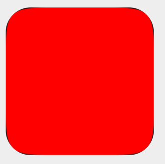

# Compose ContinuousRoundedCornerShape

Provide the ability in **Compose Multiplatform** to create **ContinuousRoundedCornerShape**, which is a smooth rounded corner.


---

## Versions

| `compose-continuous-rounded-shape` | CMP   | Kotlin |
|-------------------------------|-------|--------|
| 0.0.1-beta10                  | 1.7.1 | 2.1.0  |


## Installation

```kts
implementation("com.adamglin:compose-continuous-rounded-corner-shape:$version")
```

## Platform support

`compose-continuous-rounded-corner-shape` supports these platforms:

1. [x] Android
2. [x] iOS
3. [x] Desktop (JVM)
4. [ ] JS/Wasm (now using RoundedCornerShape compatibility, waiting androidx-graphics-shapes support web target. )

> [!IMPORTANT]  
> You can still use ContinuousRoundedCornerShape in commonMain, but the smooth parameter on the JS/Wasm side will be ignored.

## Use

The RoundedCornerShape has consistent parameters, with an additional smooth parameter, which supports values from 0f to 1f, with a default value of 0.6f, which is the default value in Apple's design system.

```kotlin
ContinuousRoundedCornerShape(50.dp, smooth = 1f)
```

smooth support from 0f to 1f, the design of ios is 0.6f.

```kotlin
Box {
    Box(
        modifier = Modifier
            .padding(20.dp)
            .size(300.dp)
            .clip(RoundedCornerShape(50.dp)) // .clip(RoundedCornerShape(50.dp,50.dp,50.dp,50.dp,0.6f))
            .background(Color.Black)
    )
    Box(
        modifier = Modifier
            .padding(20.dp)
            .size(300.dp)
            .clip(ContinuousRoundedCornerShape(50.dp, smooth = 1f))
            .background(Color.Red)
    )
}
```


